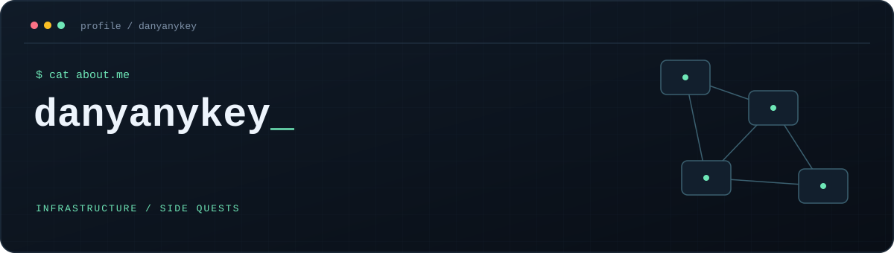

  

  <strong>Trying to be better</strong>

  <a href="#current-quest">Current quest</a> ·
  <a href="#tools--topics">Tools &amp; topics</a> ·
  <a href="#things-i-build">Things I build</a> ·
  <a href="#side-quests">Side quests</a>

---

### Current quest

**From fixing everyday IT problems to understanding and building reliable systems.**

- Develop a deeper understanding of system administration and networking.
- Explore repeatable infrastructure with Ansible, Docker, and Kubernetes.
- Learn how monitoring and observability help explain what's happening inside a system.
- Grow toward SRE through hands-on practice and small projects.

### Tools & topics

The technologies and ideas I'm interested in exploring:

| Area | What draws me in |
| :--- | :--- |
| Infrastructure | System administration · Docker · Kubernetes |
| Automation | Ansible · repeatable setups · less manual work |
| Reliability | SRE · monitoring · observability · troubleshooting |
| Networking | OSI model · protocols · how systems connect |
| Building | Vibe coding · AI-assisted experiments · practical tools |

### Things I build

- **[effective-mobile-test](https://github.com/danyanykey/effective-mobile-test)** — a Python repository.
- **[flappy-game](https://github.com/danyanykey/flappy-game)** — a JavaScript game project.

### Side quests

When I'm away from IT, you'll probably find me in **World of Warcraft** or getting lost in a single-player game. I also follow the gaming industry and enjoy seeing where games and technology are headed.

---

  <samp>Learning the systems. Automating the routine. Enjoying the game.</samp>

